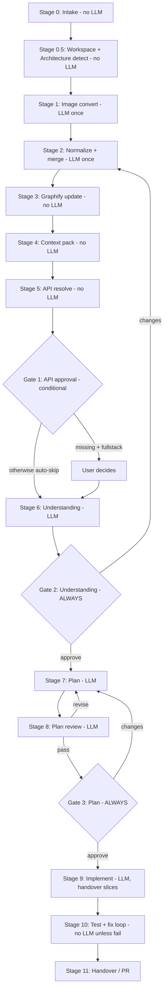

# UiForgeMax MCP — Master Plan

> Single source of truth. Merges the token-optimized pipeline, image/API resolution (Plan #5), and human gates + architecture adapters (Plan #6).
>
> **Status:** Finalized for implementation. Start at Phase 1.

---

## 1. Goal & Principles

UiForgeMax is an MCP server that turns a requirement (Jira, wireframe, image, HTML, or prompt) into working, tested, PR-ready code — with human approval gates and minimal LLM token usage.

| Principle | Meaning |
|-----------|---------|
| **Graphify owns facts** | Topology, components, routes, APIs, tokens come from deterministic indexing — never LLM guessing |
| **LLM owns judgment only** | 5 core LLM calls: normalize, understand, plan, review plan, implement |
| **Convert once, reuse forever** | Images → `visual-spec.json` once; raw image kept only for snapshot tests |
| **Single source of truth per run** | Every stage reads/writes versioned JSON under `.uiforgemax/runs/<id>/` |
| **Human gates before irreversible work** | Understanding → Plan (after LLM review); conditional API gate |
| **Delta, never restart** | Rejections re-run only the affected stage (~1k tokens) |
| **Hard token caps** | LLM input is narrow even when Graphify queries are wide |

**Target:** ~60–70% fewer tokens than a naive "read whole repo + attach wireframe + plan + implement" flow.

---

## 2. Pipeline Overview



### Canonical Stage Numbering (one source of truth)

| Stage | Name | LLM? |
|-------|------|------|
| 0 | Intake | No |
| 0.5 | Workspace + architecture detect | No |
| 1 | Image convert | Once (multimodal) |
| 2 | Normalize + merge | Once (text) |
| 3 | Graphify update | No |
| 4 | Context pack build | No |
| 5 | API / backend resolve | No |
| 5.5 | **Gate 1 — API approval** (conditional) | No |
| 6 | Requirements understanding | Once |
| 6.5 | **Gate 2 — Understanding approval** (always) | No |
| 7 | Implementation plan | Once |
| 8 | Plan review | Once |
| 8.5 | **Gate 3 — Plan approval** (always) | No |
| 9 | Implement (branch + handover slices) | Once + bounded fixes |
| 10 | Test + fix loop | No / small on fail |
| 11 | Handover / PR | Tiny / template |

**Minimum LLM calls per successful run: 5** (image convert skipped if no image).

---

## 3. Token Budgets (hard caps)

The complexity score (Section 8) widens **Graphify queries**, never the **LLM input**.

| Stage | LLM input cap | In context | Never in context |
|-------|--------------|-----------|------------------|
| 1 Image convert | ~2–4k | image + classifier prompt | repo, Jira body |
| 2 Normalize | ~2k | visual-spec + Jira AC + prompt | image, repo tree |
| 6 Understanding | ~1.5k | context-pack summary + AC list | full graph, image |
| 7 Plan | ~2–3k | context pack + normalized reqs | all of `.uiforge/`, image |
| 8 Plan review | ~1.5k | plan JSON + AC checklist | context pack, image |
| 9 Implement | **~5k per file slice** | one-file handover slice | full context pack, image, Jira body |

| Complexity | Context pack (LLM) | Plan JSON | Implement handover |
|------------|-------------------|-----------|--------------------|
| Standard | 150 lines | paths only | ~5k max |
| Complex | 200 lines | paths + aliases | ~6k max |
| Enterprise | **200 lines (not 250)** | paths + aliases + boundary refs | per-file slices ~2k each |

**Rule:** Verbose detail is allowed only in human-facing markdown at Gate 3. `implementation-plan.json` is always compact.

---

## 4. Run Artifact Layout

```text
.uiforgemax/runs/<run-id>/
├── run.json                       # master state machine + stage pointers
├── inputs/                        # raw, never re-sent to LLM
│   ├── jira.raw.json
│   ├── wireframe.png
│   ├── page.html
│   └── prompt.txt
├── visual-spec.json               # from image (once)
├── requirements.normalized.json   # merged requirements + overrides
├── graph/
│   ├── index/                     # Graphify index snapshots
│   └── context-pack.json          # the ONLY project knowledge LLM sees
├── api-resolution.json
├── plans/
│   ├── understanding.md
│   ├── implementation-plan.json   # primary, compact
│   ├── implementation-plan.md     # human view
│   └── plan-review.json
├── implementation/
│   ├── codex-handover.json        # minimal per-file implement context
│   └── diff-summary.json
├── tests/
│   ├── unit-results.json
│   └── ui-results.json
└── handover/
    └── delivery-report.md
```

---

## 5. Stage Specifications

### Stage 0 — Intake (No LLM)

- Accept one or more input modes (combinable): `jira`, `wireframe`/`image`, `html`, `prompt`.
- Create `run.json`; store raw files under `inputs/`.
- Parse Jira mechanically: description, **acceptance criteria**, **attachments**, labels.
- **Jira comment overrides:** parse comments chronologically, detect override patterns ("change X to Y", "don't use…", "use green not blue"), record as `overrides[]` to apply before Gate 2.
- Detect flags: `matchExactly`, resolution policy (`frontend_first` | `full_stack` | `extend_existing` | `contract_driven`).

**Input modes matrix:**

| Mode | Primary fields |
|------|----------------|
| jira | description, acceptanceCriteria, attachments[], labels, comments |
| wireframe/image | layout, components, tokens (via Stage 1) |
| html | DOM structure, classes, copy (mechanical parse first) |
| prompt | free-text intent |

### Stage 0.5 — Workspace + Architecture Detect (No LLM)

- Resolve target workspace (auto or ask once).
- Run architecture adapters (Section 7). Produce composite `ArchitectureInfo` (structural primary + platform overlays).
- Compute complexity score (Section 8) to set query scoping and context-pack cap.

### Stage 1 — Image Convert (LLM, single multimodal pass)

**Rule:** Image is processed **once here only**. Never attached to any later LLM call.

Single structured prompt returns four sections in one response:

```json
{
  "imageType": "wireframe | high_fidelity_mock | screenshot_existing | annotated_design | flow_diagram",
  "layout": { "viewport": {}, "regions": [] },
  "components": [],
  "interactions": [],
  "visualTokens": { "colors": [], "typography": [], "spacing": [] },
  "confidence": 0.0,
  "uncertainFields": []
}
```

- Each field carries `confidence`; below threshold (0.75) → `needsConfirmation: true`.
- **Confidence gate** (composite conversion score):
  `0.30*layout + 0.25*component + 0.25*interaction + 0.20*apiResolution`
  - ≥ 0.85 → auto-proceed
  - 0.65–0.84 → proceed with `assumptions[]`, confirm at Gate 2
  - < 0.65 → block; structured clarification (named-field Q&A, **no image re-send**)
- **Output:** `visual-spec.json`. Raw image retained on disk for snapshot tests only.
- **matchExactly:** Pass for visual tokens + exact copy strings + layout bounds mandatory; feeds snapshot/DOM tests later.

### Stage 2 — Normalize + Merge (LLM, text only)

Input (text only): `visual-spec.json`, Jira description + AC, HTML DOM summary, prompt, `overrides[]`.

Output: `requirements.normalized.json`

```json
{
  "scope": { "in": [], "out": [] },
  "acceptanceCriteria": [],
  "compliance": { "matchExactly": false, "sources": [] },
  "dataNeeds": [],
  "assumptions": [],
  "conflicts": [],
  "overrides": []
}
```

**Merge priority rules:**

| Conflict | Resolution |
|----------|------------|
| Jira AC + image agree | keep, boost confidence |
| Jira AC contradicts image | block; ask user |
| Jira says match exactly | image wins on visual tokens; Jira wins on behavior text |
| Image only, no Jira | AC marked `provisional` until Gate 2 |
| Comment override vs description | latest override wins; record in `overrides[]` |

Strip Jira boilerplate, HTML noise, duplicate AC. Cap ~2k tokens.

### Stage 3 — Graphify Update (No LLM)

Incremental deterministic index of the target project:
- File tree + module boundaries
- Components (name, path, exports, props)
- Routes/pages
- API catalog (code scan + `.uiforge/api-catalog.md`)
- Test locations + patterns
- Design tokens (CSS vars + `.uiforge/design-system.md`)

For monorepos, use the architecture adapter's native graph (e.g., NX project graph) instead of raw file scanning. Replaces "read @workspace" entirely.

### Stage 4 — Context Pack (No LLM)

Query **only** what normalized requirements need. Output `context-pack.json`, capped per complexity (150/200 lines).

```json
{
  "architecture": { "type": "", "targetApp": "", "targetDomain": "" },
  "conventions": { "newComponent": "", "importAlias": "", "testPattern": "", "barrelExport": "" },
  "reuse": [{ "name": "DataGrid", "path": "", "props": ["data", "columns"] }],
  "routes": [{ "path": "/customers", "file": "" }],
  "apis": [{ "op": "listCustomers", "method": "GET", "path": "/api/customers", "client": "" }],
  "gaps": [{ "need": "exportCSV", "status": "missing" }],
  "wiringSnippet": "…10-line hook pattern…",
  "testPattern": "…one example test path + pattern…"
}
```

This is the **only** project knowledge downstream LLM stages may read.

### Stage 5 — API / Backend Resolve (No LLM)

Match `requirements.normalized.json.dataNeeds[]` against the Graphify API index.

| Graphify result | Action | Token impact |
|-----------------|--------|--------------|
| exists complete | `reuse` | plan cites path only |
| partial | `extend` | plan lists delta only |
| missing + frontend_first | `mock` | mock file path in plan |
| missing + full_stack | `block` → Gate 1 | user decides before plan |

Output `api-resolution.json` (merged into context pack). When missing but required, emit `proposedContracts[]` (OpenAPI-style stub + mock file + optional backend task).

### Stage 5.5 — Gate 1: API Approval (conditional)

Shown only when APIs missing **and** policy is `full_stack`.

| User choice | Effect |
|-------------|--------|
| Use mock | switch to `frontend_first`, skip backend creation, continue |
| Provide endpoint | merge path into `api-resolution.json`, continue |
| Block | run status `blocked`, wait |

### Stage 6 — Requirements Understanding (LLM)

Input: `requirements.normalized.json` + `context-pack.json` (not image, not repo).
Output: `understanding.md` — what we build (≤5 bullets), AC→implementation mapping, reuse/create/mock, assumptions + API gaps, overrides applied, compliance notes.

### Stage 6.5 — Gate 2: Understanding Approval (ALWAYS)

User approves or sends delta feedback → re-run Stage 2 merge only (no image reprocess, no re-index).

### Stage 7 — Implementation Plan (LLM)

Input: approved understanding + context pack + normalized reqs.
Output: `implementation-plan.json` (compact, paths only — no code) + `implementation-plan.md` (human).

```json
{
  "topology": { "layers": [], "entryPoints": [] },
  "reuse": [],
  "create": [{ "path": "", "purpose": "" }],
  "modify": [{ "path": "", "changes": "" }],
  "mocks": [],
  "tests": { "unit": [], "ui": [], "snapshots": [] },
  "executionOrder": [],
  "estimatedFiles": 0
}
```

### Stage 8 — Plan Review (LLM, reviewer agent)

Input: `implementation-plan.json` + AC checklist **only** (no context pack, no image).
Checks: every AC covered? every path justified? matchExactly → snapshot tests present? scope creep vs normalized reqs?
Output: `plan-review.json`

```json
{ "verdict": "pass | revise | block", "coverage": { "acTotal": 0, "acCovered": 0, "gaps": [] }, "risks": [], "requiredPlanChanges": [] }
```

`revise` → Stage 7 with delta only (failed checks + plan JSON).

### Stage 8.5 — Gate 3: Plan Approval (ALWAYS)

User approves or requests changes → delta re-plan.

### Stage 9 — Implement (LLM, focused handover slices)

- Create git branch.
- For **each file**, build a `codex-handover.json` slice mechanically from plan + context pack:

```json
{
  "filesToGenerate": [{
    "path": "src/pages/CustomerList.tsx",
    "action": "create",
    "imports": ["DataGrid from @org/shared-ui"],
    "tokensUsed": ["--primary", "--spacing-md"],
    "wiring": "…10 lines…",
    "acceptanceRefs": ["AC-001", "AC-002"]
  }],
  "mocks": [{ "path": "src/mocks/customers.json", "schema": {} }],
  "doNotTouch": ["src/components/DataGrid.tsx"]
}
```

- **Never send:** full context pack, image, Jira body. Commit per file. Write `diff-summary.json`.

### Stage 10 — Test + Fix Loop (No LLM unless failure)

- Unit: project test runner.
- UI/DOM: component tests + Playwright if flows changed.
- matchExactly: visual snapshot vs stored image + text_match + layout bounds assertions.
- Fix loop: max 2 iterations; input = failing output + affected file only (~1k tokens).

### Stage 11 — Handover / PR

`delivery-report.md` (mostly template): what was built, files changed, how to run/test, known limitations, artifact links. PR-ready branch; user merges.

---

## 6. Human Gates & Delta Revise

```text
AUTOMATIC ZONE (0–5) → Gate 1 (conditional) → Understanding → Gate 2 (always)
→ Plan + Review → Gate 3 (always) → AUTOMATIC ZONE (9–11) → Delivered PR
```

- No code touches the project without Gate 2 + Gate 3 approval.
- **Delta revise hard rule:** rejection sends only feedback + existing JSON (~1k tokens). Never re-process images, re-index Graphify, or re-run intake. Enforced in `run.json` transitions.

---

## 7. Architecture Adapter System

Pluggable adapters detect structure, project graph, file placement, import patterns, boundary rules, and extra configs.

```typescript
interface ArchitectureAdapter {
  detect(projectPath: string): Promise<boolean>;
  getProjectGraph(): Promise<ProjectGraph>;
  getProjectByName(name: string): Promise<Project>;
  resolveTargetProject(req: NormalizedRequirement): Promise<TargetProject>;
  resolveFileLocation(fileType: FileType, targetProject: string): Promise<string>;
  getConventions(): Promise<ArchitectureConventions>;
  getBoundaryRules(): Promise<BoundaryRule[]>;
  getImportPattern(from: string, to: string): string;
  getModulePattern(): ModulePattern;
  getExtraConfigs(): Promise<ExtraConfig[]>;
}
```

**Built-in adapters:** `NxAdapter`, `TurboAdapter`, `LernaAdapter`, `RushAdapter`, `OpenFinAdapter`, `MicroFrontendAdapter`, `StandardAdapter` (fallback: Vite/Next/Angular).

### Composite Primary Selection (fix for `detected[0]`)

A project can match multiple adapters (e.g., NX + OpenFin). Do **not** use first-match.

```typescript
primary = selectPrimary(detected)
// 1. Structural primary: NX / Turbo / Rush / Lerna → graph + file placement
// 2. Platform overlay: OpenFin / MicroFrontend → conventions + extra configs
// 3. Composite: structural.resolveFileLocation + overlay.getExtraConfigs()
```

- **Spike (Phase 1):** verify NX graph export command against installed version (`nx graph --file=…` vs `nx show projects --json` vs parsing `project.json`).

### Downstream effects

- **Stage 3:** index per NX project with tags/boundaries; index OpenFin `app.json` + `src/views/`.
- **Stage 4:** context pack includes `architecture`, `conventions`, domain reuse, OpenFin view/interop context.
- **Stage 7:** plan includes lib creation (`project.json`), barrel exports, `tsconfig.base.json` alias, manifest `merge-views`.

---

## 8. Complexity Score (query scoping, not verbosity)

```typescript
function calculateComplexityScore(arch): ComplexityScore {
  let score = 0;
  if (arch.primary instanceof NxAdapter) score += 3;
  if (arch.primary instanceof TurboAdapter) score += 2;
  const n = arch.projectGraph.projects.length;
  score += n > 50 ? 3 : n > 20 ? 2 : n > 5 ? 1 : 0;
  if (arch.adapters.some(a => a instanceof OpenFinAdapter)) score += 2;
  if (arch.adapters.some(a => a instanceof MicroFrontendAdapter)) score += 2;
  if (arch.boundaryRules.length > 10) score += 1;
  return {
    score,
    level: score > 7 ? "enterprise" : score > 4 ? "complex" : "standard",
    contextPackLineLimit: score > 7 ? 200 : score > 4 ? 200 : 150, // cap 200 for LLM
    graphifyDepth: score > 7 ? "full" : "targeted",
    humanPlanDetail: score > 7 ? "verbose" : "standard" // markdown only, NOT json
  };
}
```

**Rule:** score widens Graphify depth and human markdown detail only. `implementation-plan.json` and implement handover stay compact.

---

## 9. MCP Tool Surface

**Lifecycle:** `uiforgemax_start_run`, `uiforgemax_get_run_status`, `uiforgemax_cancel_run`, `uiforgemax_advance` (runs non-LLM stages, stops at gates).

**Input:** `uiforgemax_add_jira`, `uiforgemax_add_prompt`, `uiforgemax_add_html`, `uiforgemax_add_image`.

**Pipeline (prefer `advance`):** `uiforgemax_convert_image`, `uiforgemax_normalize`, `uiforgemax_graphify_update`, `uiforgemax_build_context_pack`, `uiforgemax_resolve_api_needs`, `uiforgemax_generate_understanding`, `uiforgemax_generate_plan`, `uiforgemax_review_plan`, `uiforgemax_implement`, `uiforgemax_run_tests`, `uiforgemax_finalize`.

**Approvals:** `uiforgemax_approve_understanding`, `uiforgemax_approve_plan`, `uiforgemax_approve_api`, `uiforgemax_request_changes` (delta), `uiforgemax_answer_clarifications` (structured, no image re-upload).

---

## 10. run.json State Machine

```json
{
  "runId": "20260718-001",
  "projectRoot": "/path/to/app",
  "status": "awaiting_plan_approval",
  "currentStage": 8,
  "inputs": { "modes": ["jira", "wireframe"] },
  "architecture": { "primary": "nx", "overlays": ["openfin"], "complexity": "enterprise" },
  "compliance": { "matchExactly": true, "sources": ["inputs/wireframe.png"] },
  "artifacts": {
    "visualSpec": "visual-spec.json",
    "requirements": "requirements.normalized.json",
    "contextPack": "graph/context-pack.json",
    "apiResolution": "api-resolution.json",
    "plan": "plans/implementation-plan.json",
    "planReview": "plans/plan-review.json"
  },
  "approvals": {
    "api": { "required": false, "approved": true },
    "understanding": { "approved": true, "at": "" },
    "plan": { "approved": false }
  },
  "history": [{ "stage": 6, "at": "", "result": "ok" }]
}
```

**Statuses:** `intake` → `arch_detected` → `image_converted` → `normalized` → `graph_ready` → `context_ready` → `api_resolved` → (`awaiting_api_approval`) → `understanding_ready` → `awaiting_understanding_approval` → `plan_ready` → `plan_reviewed` → `awaiting_plan_approval` → `implementing` → `testing` → `validating` → `completed` | `failed` | `blocked` | `cancelled`

---

## 11. Exact-Match (matchExactly) Handling

| Phase | Behavior |
|-------|----------|
| Stage 1 convert | extract copy + layout bounds + tokens → `visual-spec.json`; visual-token pass mandatory |
| Stage 2 normalize | set `compliance.matchExactly = true`, record sources |
| Stage 6 understanding | list measurable checks |
| Stage 7 plan | must include snapshot/DOM tests |
| Stage 8 review | reject plan lacking compliance tests |
| Stage 10 test | snapshot vs stored image + `text_match` + `layout_bounds` (tolerance px) |
| LLM | image **not** used after Stage 1 |

---

## 12. Repository Structure

```text
UiforgeMax/
├── MASTER_PLAN.md               ← this document
├── packages/
│   ├── mcp-server/              # MCP tools + orchestration
│   ├── graphify/                # update/query engine
│   ├── pipeline/                # stage runners + state machine
│   ├── schemas/                 # JSON schemas for run artifacts
│   ├── architecture/            # adapters (nx, turbo, openfin, mfe, standard)
│   └── adapters/
│       ├── jira/
│       ├── wireframe/
│       └── html/
├── prompts/                     # stage-specific LLM prompts
├── templates/
└── examples/
    └── sample-run/
```

---

## 13. Build Phases

| Phase | Scope | Priority |
|-------|-------|----------|
| **0** | MCP server skeleton, state-gated tool wrappers, `AGENTS.md`, `mcp.json.example`, Jira adapter (read-only), config validation | P0 |
| **1** | `run.json`, JSON schemas, Graphify update/query, context-pack cap | P0 |
| **1.5** | Architecture detect + `StandardAdapter` only + NX-graph spike | P0 |
| **2** | Image convert + normalize + API resolve + Gate 1 | P0 |
| **3** | Gates 2–3 + delta revise | P0 |
| **4** | Plan + plan review + `codex-handover.json` + implement | P0 |
| **5** | Tests + branch delivery + handover report | P0 |
| **6** | `NxAdapter` + composite merge | P1 |
| **7** | OpenFin, Turbo, MFE adapters | P2 |
| **8** | Jira comment overrides | P2 |

### MVP Slice (ship first)

1. Prompt + one wireframe (no Jira yet).
2. `StandardAdapter`, single app (Vite/Next).
3. Stages 1 → 2 → 3 → 4 → 5 → 6 → **Gate 2** → 7 → 8 → **Gate 3** → 9 → 10 → 11.
4. Mock API policy (`frontend_first`).
5. Token logging per LLM call to prove savings.

Then add Jira, exact-match compliance, NX/OpenFin adapters, full-stack backend.

---

## 14. Open Decisions

1. **Graphify tech:** tree-sitter graph vs LSP vs extend `generate_uiforge.py` first.
2. **LLM runtime:** Cursor agent in-IDE only, or Cursor SDK for CI.
3. **Jira auth:** Atlassian MCP vs REST token vs webhook-triggered runs.
4. **UI testing:** Playwright in-repo vs Cursor browser MCP.
5. **NX graph export:** confirm command per version (Phase 1 spike).

---

## 15. Agent Control, Orchestration & Anti-Autonomy

The biggest risk in an LLM-driven pipeline is an agent "going autonomous" — skipping gates, calling tools out of order, or implementing before approval. UiForgeMax prevents this with **three layers of control**, in priority order.

### Two kinds of agent (do not conflate)

| Agent | Who | Governed by | Can it deviate? |
|-------|-----|-------------|-----------------|
| **Driving agent** | The Cursor IDE agent (LLM) that calls `uiforgemax_*` tools | `AGENTS.md` control prompt (advisory) + server refusal (authoritative) | No — server refuses out-of-order calls |
| **Internal stage agents** | The narrow LLM calls UiForgeMax makes inside a stage | Per-stage prompt in `prompts/` (pure function: fixed input → structured output) | No — cannot call MCP tools or pick the next stage |

**Golden rule:** The LLM never orchestrates. A deterministic state machine (the `pipeline` package) decides what runs next. Each LLM call is a pure function with narrow input and schema-validated output. It cannot invoke the next stage, call MCP tools freely, or skip a gate.

### Layer 1 — Server-side state gating (authoritative)

This is the real guardrail. Every tool validates `run.json` before doing anything and **refuses** if prerequisites or approvals are missing. Advisory prompts are not trusted for correctness.

```typescript
// Enforced inside each tool handler, not in any prompt
const GATE_REQUIREMENTS = {
  uiforgemax_generate_plan:  (r) => r.approvals.understanding.approved === true,
  uiforgemax_implement:      (r) => r.approvals.plan.approved === true
                                    && r.artifacts.planReview?.verdict === "pass",
  uiforgemax_run_tests:      (r) => r.status === "implementing" || r.status === "testing",
};

function assertGate(tool, run) {
  const ok = GATE_REQUIREMENTS[tool]?.(run) ?? true;
  if (!ok) throw new McpError(
    `BLOCKED: ${tool} requires an unmet precondition. ` +
    `Current stage=${run.currentStage}, status=${run.status}. ` +
    `Resolve the pending gate first.`
  );
}
```

- Tools are **idempotent** and **stage-scoped**: calling `uiforgemax_implement` twice, or before approval, is a no-op error — never a second implementation.
- Approvals are **explicit and recorded** (`approvals.*.approved`, `at`, `by`). Only `uiforgemax_approve_*` can set them; the driving agent cannot self-approve.
- Every transition is appended to `run.json.history` for audit.

### Layer 2 — The `AGENTS.md` control prompt (advisory)

A root `AGENTS.md` governs the **driving agent** so it behaves predictably and does not narrate its own plans or free-lance edits. It is advisory — if it and the server disagree, the server wins. Key clauses:

1. Never edit project files directly. All changes go through `uiforgemax_implement` on an approved plan.
2. Always drive via `uiforgemax_advance`; do not hand-call stage tools unless recovering from an error.
3. Never fabricate approvals. Present the Gate 2 / Gate 3 payload to the human and wait.
4. Never re-run intake, re-index Graphify, or re-process images on feedback — use delta revise.
5. On any `BLOCKED` error, surface it to the human verbatim; do not attempt workarounds.
6. Do not read the whole repo; project facts come only from `context-pack.json`.

### Layer 3 — Per-stage prompt contracts (`prompts/`)

Each internal stage agent has its own `.md` prompt file with a locked role, fixed input list, and required output schema. A stage agent that receives anything outside its input contract must fail rather than improvise.

```text
prompts/
├── 01-image-convert.md      # in: image → out: visual-spec.json
├── 02-normalize.md          # in: visual-spec + jira AC + prompt → out: requirements.normalized.json
├── 06-understanding.md      # in: requirements + context-pack → out: understanding.md
├── 07-plan.md               # in: understanding + context-pack → out: implementation-plan.json
├── 08-plan-review.md        # in: plan.json + AC checklist ONLY → out: plan-review.json
└── 09-implement.md          # in: codex-handover slice (one file) → out: file contents
```

Each prompt ends with a hard boundary line, e.g.:

```text
OUTPUT ONLY valid JSON matching plan-review.schema.json.
You are a reviewer. You do NOT write code, call tools, or choose the next stage.
If required inputs are missing, return {"verdict":"block","requiredPlanChanges":["missing: <x>"]}.
```

### Why this stops "going autonomous"

- The driving agent *cannot* skip to implementation — the server refuses.
- The stage agents *cannot* orchestrate — they have no tool access and one job each.
- The human *must* approve at Gate 2 and Gate 3 — approvals are code-gated, not prompt-gated.
- Deviation attempts surface as explicit `BLOCKED` errors in `run.json.history`.

---

## 16. Configuration & Access (`mcp.json`, Jira, tokens)

### Two config layers

| Layer | File | Purpose |
|-------|------|---------|
| **Cursor registers the MCP server** | `.cursor/mcp.json` | Tells Cursor how to launch UiForgeMax and passes env (tokens) |
| **UiForgeMax reads credentials** | env vars referenced by `.cursor/mcp.json` | Jira / Cursor API keys used by internal adapters |

### `.cursor/mcp.json` (template committed as `mcp.json.example`)

Tokens are **never** hard-coded. Reference OS environment variables so secrets stay out of git.

```json
{
  "mcpServers": {
    "uiforgemax": {
      "command": "node",
      "args": ["packages/mcp-server/dist/index.js"],
      "env": {
        "JIRA_BASE_URL": "https://your-org.atlassian.net",
        "JIRA_EMAIL": "${env:JIRA_EMAIL}",
        "JIRA_API_TOKEN": "${env:JIRA_API_TOKEN}",
        "CURSOR_API_KEY": "${env:CURSOR_API_KEY}",
        "UIFORGEMAX_DEFAULT_POLICY": "frontend_first"
      }
    }
  }
}
```

- Put real values in your shell profile or a git-ignored `.env`, not in `mcp.json`.
- `mcp.json.example` is committed; `.cursor/mcp.json` with resolved values is git-ignored.

### How Jira is accessed

UiForgeMax owns a **Jira adapter** (`packages/adapters/jira/`) — Jira access is internal to the server, not a separate MCP you have to wire the driving agent into. Two supported modes:

| Mode | Auth | When |
|------|------|------|
| **REST (default)** | Basic auth: `JIRA_EMAIL` + `JIRA_API_TOKEN` (Atlassian API token), base64-encoded | Self-hosted control, simplest |
| **Atlassian Remote MCP** | OAuth via Atlassian's hosted MCP | If you prefer Atlassian-managed auth; UiForgeMax proxies calls |

**REST flow (Stage 0):**

```text
uiforgemax_add_jira("PROJ-1234")
  → GET {JIRA_BASE_URL}/rest/api/3/issue/PROJ-1234?fields=description,summary,labels,attachment,comment
  → fetch description, acceptance criteria (from field or description panel)
  → download attachments to inputs/
  → fetch comments → parse overrides[] (Stage 0 override logic)
  → detect matchExactly from labels/text
  → write inputs/jira.raw.json
```

Required Jira scopes: read issues, read attachments, read comments. A **read-only** API token is sufficient — UiForgeMax never writes back to Jira in the core flow.

### Secret handling rules

- Secrets only ever live in env vars / git-ignored `.env`; never in `run.json`, artifacts, logs, or the repo.
- `.gitignore` must include `.env`, `.cursor/mcp.json`, and `.uiforgemax/runs/` (run artifacts may contain requirement text).
- The Jira adapter redacts tokens from all error messages and logs.

### Startup validation (fail fast, no silent autonomy)

On launch, `mcp-server` validates config and refuses to start ambiguously:

```text
✓ JIRA_BASE_URL set and reachable
✓ JIRA_API_TOKEN present (redacted)
✓ CURSOR_API_KEY present (redacted)  [only if internal LLM calls use SDK]
✗ Missing → server starts but uiforgemax_add_jira returns a clear config error,
             never a guessed/hallucinated issue.
```

---

## 17. Summary

UiForgeMax is a stage-gated MCP pipeline where **Graphify eliminates repo-reading tokens**, **images convert once to JSON**, **APIs resolve deterministically (reuse/extend/mock/block)**, and each LLM stage receives a small, capped input derived from artifacts. Three human touchpoints (conditional API gate, always-on Understanding and Plan gates) protect against wrong work, and delta revise keeps corrections cheap. Enterprise monorepos (NX, Turbo, OpenFin, micro-frontends) are handled via composite architecture adapters without inflating LLM context.

**Agents cannot go autonomous:** the LLM never orchestrates — a deterministic state machine does. Tools are state-gated and refuse out-of-order or unapproved calls (authoritative), `AGENTS.md` keeps the driving agent predictable (advisory), and per-stage prompt contracts give each internal agent one job with no tool access. Jira is accessed through an internal read-only adapter using tokens supplied via `.cursor/mcp.json` env references — never hard-coded, never committed.
